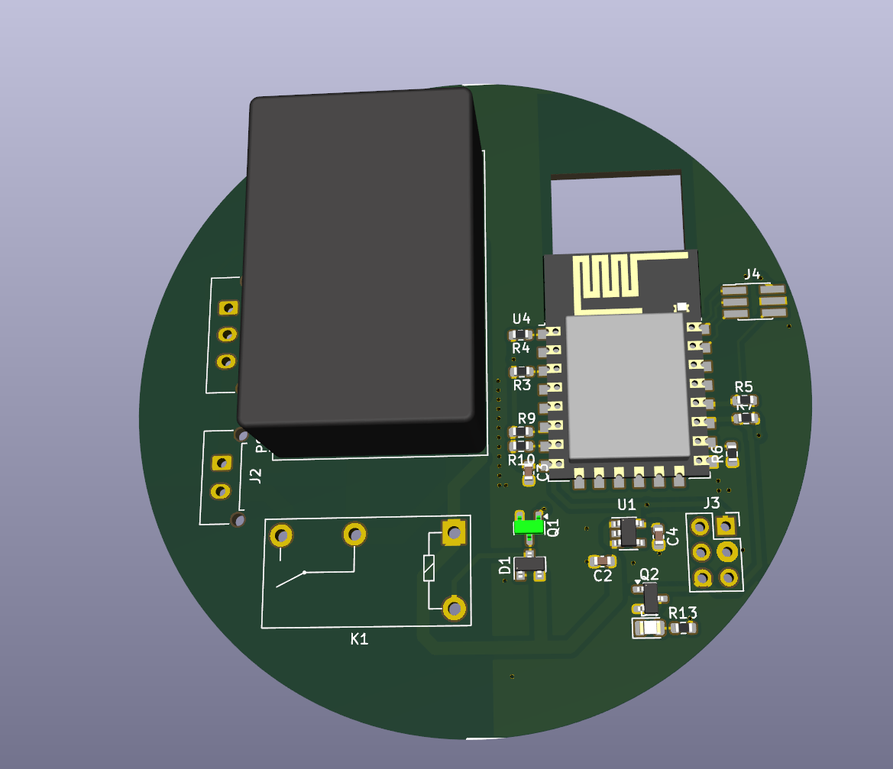
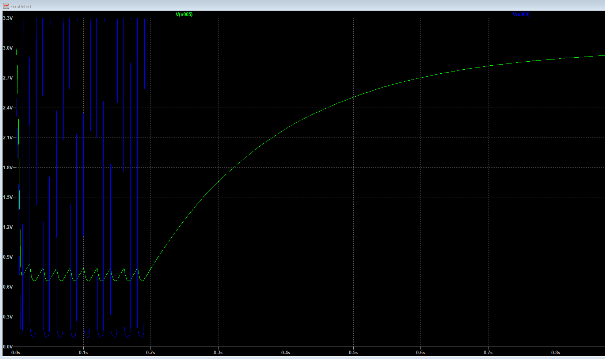

# Loftrelæ Round

Round ceiling-mounted relay module with ESP8266/Home Assistant integration, AC sense input, relay output, KiCad PCB files, LTspice simulation files, Gerber production files, interactive BOM, and 3D-printable enclosure files.

> **Warning — mains voltage**
>
> This project is intended for work around 230 VAC mains wiring. Only build, test, or install it if you are qualified to work on mains-powered equipment and understand local electrical regulations. Always isolate power before touching the circuit. Use correct fusing, creepage, clearance, strain relief, enclosure material, and certified installation practices. The repository files are design files and do not by themselves make the product certified for permanent installation.



---

## Project purpose

`Loftrelæ Round` is designed as a compact round relay module for ceiling installation. It is intended to fit into a round ceiling bracket or ceiling-mounted housing.

The module connects to:

- **P / phase / live**
- **N / neutral**
- **M1 / switched or sense input**

The sense input is used to monitor whether the original wall switch or local switch has been activated. The ESP8266 firmware publishes the relay state and sense state to Home Assistant by MQTT, so the original physical switch can still be used while Home Assistant can monitor and control the relay.

---

## Repository structure

```text
Loftrel-Round/
├── ACMonitorHA/
│   └── ACMonitorHA.ino              # ESP8266 firmware
├── PCB/
│   ├── LoftRelayRoundGerber/        # Gerber + drill files for PCB production
│   ├── Simulation/                  # LTspice zero-detect simulation
│   ├── bom/
│   │   └── ibom.html                # Interactive HTML BOM
│   ├── ESP8266.kicad_sch            # ESP8266 schematic sheet
│   ├── loftrelayRound.kicad_pro     # KiCad project
│   ├── loftrelayRound.kicad_sch     # Main KiCad schematic
│   ├── loftrelayRound.kicad_pcb     # KiCad PCB layout
│   └── loftrelayRound.pdf           # Schematic PDF export
├── Rund Print 3D/
│   ├── Lys Driver.stl
│   ├── Lys Driver Låg.stl
│   └── Lys Driver Låg 2mm.stl
└── README.md
```

---

## Main features

- Round ceiling relay PCB format.
- ESP8266 / ESP-12E based controller.
- MQTT integration with Home Assistant.
- Home Assistant MQTT discovery.
- Relay output on GPIO15.
- AC/switch sense input through:
  - analog ADC level on A0
  - digital state on GPIO5
- Status LED on GPIO2.
- MQTT availability topic.
- Separate MQTT event topic for toggle/state-change handling.
- KiCad schematic, PCB layout, Gerber production output, drill files, simulation files, and 3D-printable enclosure parts.

---

## Hardware overview

### Functional blocks

```text
230 VAC input
   │
   ├── Power supply section
   │      └── Provides low-voltage supply for ESP8266 and relay electronics
   │
   ├── Relay switching section
   │      └── Controlled by ESP8266 GPIO15
   │
   ├── AC / switch sense section
   │      ├── Analog sense to ESP8266 A0
   │      └── Digital sense to ESP8266 GPIO5
   │
   └── ESP8266 controller
          ├── Wi-Fi
          ├── MQTT
          ├── Home Assistant discovery
          ├── GPIO2 LED
          └── GPIO15 relay output
```

### Important ESP8266 pin assignments

| ESP8266 pin | Function | Notes |
|---|---|---|
| A0 | Analog AC/sense level | Used for threshold + hysteresis detection |
| GPIO5 | Digital AC/sense input | Published as binary sensor |
| GPIO2 | Status LED | Often active-low on ESP8266 boards |
| GPIO15 | Relay output | Must be compatible with ESP8266 boot requirements |
| 3V3 | Logic supply | Stable 3.3 V required |
| GND | Logic ground | Low-voltage reference |

### ADC warning

The bare ESP8266/ESP-12E ADC input is normally limited to approximately **0–1.0 V**. Some development boards include a resistor divider and accept a larger input range. The firmware currently uses:

```cpp
const float ADC_FULL_SCALE_V = 3.3;
```

Verify the actual ADC scaling on the PCB before applying a voltage to A0. If the PCB feeds the bare ESP8266 ADC directly, the maximum allowed voltage must not exceed the ESP8266 ADC rating.

---

## Firmware

The firmware is located in:

```text
ACMonitorHA/ACMonitorHA.ino
```

It is written for the Arduino ESP8266 core and uses MQTT for communication with Home Assistant.

### Required Arduino libraries

Install these in Arduino IDE or PlatformIO:

- ESP8266 Arduino core
- `ESP8266WiFi`
- `PubSubClient`

### Configuration file

The firmware includes:

```cpp
#include "secrets.h"
```

Create `ACMonitorHA/secrets.h` locally. Do not commit real Wi-Fi or MQTT credentials.

Example:

```cpp
#pragma once

#define sWIFI_SSID     "YourWiFiSSID"
#define sWIFI_PASS     "YourWiFiPassword"

#define sMQTT_SERVER   "192.168.1.10"
#define sMQTT_USER     "mqtt_user"
#define sMQTT_PASS     "mqtt_password"

// Static IP configuration
#define LOCAL_IP       192,168,1,50
#define GATEWAY_IP     192,168,1,1
#define SUBNET_MASK    255,255,255,0
```

### Core firmware settings

```cpp
const char* DEVICE_ID   = "acmonitorha_01";
const char* DEVICE_NAME = "ACMonitorHA";

const float ADC_FULL_SCALE_V = 3.3;

float LOW_THRESHOLD_V  = 1.3;
float HIGH_THRESHOLD_V = 1.6;

const uint8_t PIN_DIGITAL_AC = 5;   // GPIO5
const uint8_t PIN_LED        = 2;   // GPIO2
const uint8_t PIN_RELAY      = 15;  // GPIO15
```


### MQTT topic layout

Base topic:

```text
acmonitorha/acmonitorha_01
```

Published topics:

| Topic | Purpose | Retained |
|---|---|---|
| `acmonitorha/acmonitorha_01/availability` | Online/offline state | Yes |
| `acmonitorha/acmonitorha_01/state` | JSON state payload | Yes |
| `acmonitorha/acmonitorha_01/event` | JSON toggle counter/event | No |
| `acmonitorha/acmonitorha_01/trigger/ac_toggle` | Simple trigger payload for HA automation | No |
| `acmonitorha/acmonitorha_01/relay/set` | Relay command topic | No |

### Example state payload

```json
{
  "adc_voltage": 1.542,
  "ac_state": "ON",
  "gpio5": "ON",
  "relay": "OFF",
  "low_threshold": 1.30,
  "high_threshold": 1.60
}
```

### Home Assistant MQTT discovery entities

The firmware publishes MQTT discovery for:

| Home Assistant entity | Type | Description |
|---|---|---|
| AC ADC Voltage | Sensor | ADC voltage in volts |
| AC Analog State | Binary sensor | Hysteresis-filtered AC/switch state |
| AC GPIO5 State | Binary sensor | Digital state from GPIO5 |
| AC Relay | Switch | Relay output control |
| AC Toggle Event | Sensor | Counter incremented on analog state change |
| `ac_toggle` | Device automation trigger | Trigger event for automations |

### Home Assistant automation trigger

The device automation trigger listens for:

```text
topic: acmonitorha/acmonitorha_01/trigger/ac_toggle
payload: TOGGLE
```

Example Home Assistant automation using raw MQTT trigger:

```yaml
alias: Loftrelæ Round toggle event
mode: single

trigger:
  - platform: mqtt
    topic: acmonitorha/acmonitorha_01/trigger/ac_toggle
    payload: "TOGGLE"

action:
  - service: light.toggle
    target:
      entity_id: light.example_light
```

If you use Home Assistant MQTT device discovery, the same event can also appear as a device trigger named similar to:

```text
"ac_toggle" pressed
```

---

## Building and flashing the firmware

### Arduino IDE

1. Install the ESP8266 board package.
2. Select an ESP8266/ESP-12E compatible board.
3. Install `PubSubClient`.
4. Create `ACMonitorHA/secrets.h`.
5. Open `ACMonitorHA/ACMonitorHA.ino`.
6. Compile and upload.
7. Open Serial Monitor at `115200 baud`.

### PlatformIO option

A minimal `platformio.ini` can be created as:

```ini
[env:esp12e]
platform = espressif8266
board = esp12e
framework = arduino
monitor_speed = 115200

lib_deps =
    knolleary/PubSubClient
```

---

## Simulation

Simulation files are located in:

```text
PCB/Simulation/
```

Files included:

| File | Description |
|---|---|
| `ZeroDetect.asc` | LTspice schematic for zero/sense detection simulation |
| `ZeroDetect.log` | LTspice simulation log |
| `ZeroDetect.raw` | LTspice waveform result |
| `ZeroDetect.op.raw` | LTspice operating point result |

### Opening the simulation

1. Install LTspice.
2. Open:

```text
PCB/Simulation/ZeroDetect.asc
```

3. Run the simulation.
4. Inspect the generated node voltages and switching/sense waveform.
5. Compare the sense output against the firmware thresholds.

### What to verify in simulation

- The sense voltage stays inside the safe input range for the ESP8266 ADC/GPIO.
- The analog sense voltage provides enough margin around the configured thresholds.
- The digital sense level is compatible with ESP8266 3.3 V logic.
- The waveform does not contain excessive ripple that would cause false toggles.
- The low-voltage side remains isolated or otherwise protected according to the actual hardware design.
- 


---

## PCB design

PCB files are located in:

```text
PCB/
```

Main KiCad files:

| File | Description |
|---|---|
| `loftrelayRound.kicad_pro` | KiCad project |
| `loftrelayRound.kicad_sch` | Main schematic |
| `ESP8266.kicad_sch` | ESP8266 schematic sheet |
| `loftrelayRound.kicad_pcb` | PCB layout |
| `loftrelayRound.pdf` | Schematic PDF export |

Open [Schematic](./PCB/loftrelayRound.pdf) in pdf format


### Opening the PCB project

1. Install KiCad.
2. Open:

```text
PCB/loftrelayRound.kicad_pro
```

3. Inspect schematic and PCB.
4. Run ERC and DRC before manufacturing.
5. Check creepage and clearance manually for 230 VAC areas.

### PCB production files

Gerber and drill files are located in:

```text
PCB/LoftRelayRoundGerber/
```

Included production outputs:

| File | Layer / output |
|---|---|
| `loftrelayRound-F_Cu.gbr` | Front copper |
| `loftrelayRound-B_Cu.gbr` | Back copper |
| `loftrelayRound-F_Mask.gbr` | Front solder mask |
| `loftrelayRound-B_Mask.gbr` | Back solder mask |
| `loftrelayRound-F_Paste.gbr` | Front paste |
| `loftrelayRound-B_Paste.gbr` | Back paste |
| `loftrelayRound-F_Silkscreen.gbr` | Front silkscreen |
| `loftrelayRound-B_Silkscreen.gbr` | Back silkscreen |
| `loftrelayRound-Edge_Cuts.gbr` | Board outline |
| `loftrelayRound-PTH.drl` | Plated through holes |
| `loftrelayRound-NPTH.drl` | Non-plated through holes |

### Recommended PCB checks before ordering

- Verify board diameter and mechanical fit in the intended ceiling enclosure.
- Verify copper-to-copper clearance in mains sections.
- Verify slot/cutout dimensions if used for isolation.
- Verify terminal block footprints and wire entry direction.
- Verify relay footprint and coil/contact ratings.
- Verify ESP8266 antenna keep-out.
- Verify mounting holes and enclosure interference.
- Verify solder mask expansion and paste layers.
- Load Gerbers in an independent Gerber viewer before ordering.

---

## Interactive BOM

The interactive BOM is located at:

```text
PCB/bom/ibom.html
```

Open it in a browser to identify component placement, values, footprints, and assembly side.

Recommended use:

1. Open `PCB/bom/ibom.html`.
2. Select a component group.
3. Place/solder the highlighted components.
4. Mark them as placed in the iBOM interface.
5. Continue until all components are mounted.

---

## 3D printed enclosure

3D print files are located in:

```text
Rund Print 3D/
```

Included files:

| File | Description |
|---|---|
| `Lys Driver.stl` | Main printed body |
| `Lys Driver Låg.stl` | Lid |
| `Lys Driver Låg 2mm.stl` | Alternative 2 mm lid |

### Printing notes

- Use a material suitable for the installation environment.
- For mains installations, consider flame-retardant material and electrical enclosure requirements.
- Verify fit before installing electronics.
- Ensure adequate insulation and strain relief.
- Ensure that the enclosure cannot be opened without tools if installed near mains wiring.

---

## Installation concept

Typical installation concept:

```text
230 VAC supply
   ├── P / live  ──────── PCB P input
   ├── N / neutral ────── PCB N input
   └── Switched input ─── PCB M1 / sense input

PCB relay output
   └── Load / lamp / driver input
```

The actual wiring depends on the relay contact arrangement and the local installation. Check the schematic and relay contact rating before connecting any load.

---

## Commissioning checklist

Before applying mains power:

- [ ] Inspect all solder joints.
- [ ] Verify no solder bridges.
- [ ] Check polarity of capacitors, diodes, regulator, relay driver, and ESP8266 module.
- [ ] Check mains and low-voltage isolation distance.
- [ ] Check continuity between expected nets.
- [ ] Check there is no short between live and neutral.
- [ ] Check there is no short between mains side and low-voltage side unless intentionally designed.
- [ ] Verify enclosure fit.
- [ ] Verify relay contact rating.
- [ ] Verify fuse/protection if applicable.
- [ ] Verify `secrets.h` configuration.
- [ ] Flash firmware before final installation.
- [ ] Test first with current-limited or isolated setup if possible.

After applying power:

- [ ] Confirm 3.3 V supply.
- [ ] Confirm ESP8266 boots.
- [ ] Confirm Wi-Fi connection.
- [ ] Confirm MQTT availability topic becomes `online`.
- [ ] Confirm Home Assistant discovery entities appear.
- [ ] Confirm ADC voltage is realistic.
- [ ] Confirm GPIO5 state changes as expected.
- [ ] Confirm relay can be switched from Home Assistant.
- [ ] Confirm physical switch/sense input creates a toggle event.
- [ ] Confirm relay output works with the intended load.

---

## Troubleshooting

### Device does not appear in Home Assistant

Check:

- MQTT broker IP, user, and password.
- Wi-Fi SSID and password.
- `DEVICE_ID` uniqueness.
- Home Assistant MQTT integration is enabled.
- MQTT discovery is enabled in Home Assistant.
- ESP8266 serial output at `115200 baud`.

### Toggle event appears as sensor activity but automation does not trigger

Check that the firmware publishes the simple trigger payload:

```text
topic: acmonitorha/acmonitorha_01/trigger/ac_toggle
payload: TOGGLE
```

The JSON event topic and the trigger topic should be separate:

```text
/event                 -> JSON counter/log event
/trigger/ac_toggle     -> simple TOGGLE payload
```

### ADC value is wrong

Check:

- `ADC_FULL_SCALE_V`
- resistor divider values
- actual ESP8266 board/module ADC range
- whether A0 is connected to bare ESP8266 ADC or a development-board divider
- ripple/noise on the sense signal

### Relay does not switch

Check:

- GPIO15 boot requirement and output state.
- Relay driver transistor/MOSFET orientation.
- Flyback diode orientation.
- Relay coil voltage.
- Relay supply voltage.
- MQTT command topic:

```text
acmonitorha/acmonitorha_01/relay/set
```

Payload must be:

```text
ON
```

or:

```text
OFF
```

---

## Development notes

Suggested future improvements:

- Add a `platformio.ini`.
- Add schematic and PCB screenshots to the README.
- Add Gerber preview images.
- Add iBOM screenshot.
- Add enclosure render images.
- Add a wiring diagram.
- Add release ZIP containing Gerbers, BOM, schematic PDF, and firmware source.
- Add version number to firmware and MQTT state payload.
- Add retained config cleanup instructions for MQTT discovery changes.
- Add OTA update support.
- Add configurable thresholds through MQTT or Home Assistant number entities.

---

## License

No license file is currently described here. Add a `LICENSE` file if the project is intended for reuse, modification, or distribution.

---

## Disclaimer

This is a DIY electronics project involving mains voltage. The author and contributors are not responsible for damage, injury, fire, code violations, or unsafe installations. Verify the design, PCB, enclosure, wiring, component ratings, firmware behavior, and local electrical requirements before use.
